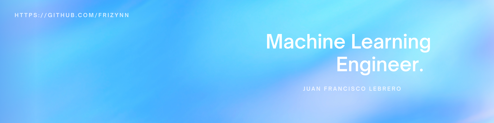

  <h1 style="font-size:2.6rem; margin-bottom: 0.2em; color:#1a202c; letter-spacing:1px;">Juan Francisco Lebrero</h1>
  <h3 style="font-weight:400; color:#4a5568; margin-top:0;">NLP Engineer · LLM & AI Platforms</h3>
  

    Training, fine-tuning, and deploying large language models at scale.
    Focused on robust evaluation, data-centric AI, and production-grade LLM platforms with real user impact.
  

  

    
    
    
    
    
    
    
  

  

    
    
    
  

  

    Based in Buenos Aires, Argentina
  

Artificial Intelligence Engineering student at the University of San Andrés (UdeSA) and NLP Engineer.  
I train, fine-tune, and distill large language models with direct impact on real products and users.  
My work focuses on scalable data architectures, rigorous evaluation frameworks, and end-to-end LLM training and serving platforms.

<h2 style="color:#1a202c; font-size:1.6rem; border-left: 4px solid #3182ce; padding-left: 12px;">Experience</h2>

  <b>NLP Engineer – Mercado Libre (Jan 2026–Present)</b>
  <ul style="margin-top:0.2em;">
    <li>Train, fine-tune, and distill large language models with direct impact on Mercado Libre products and millions of users.</li>
    <li>Design data architectures, metrics, and evaluation frameworks to ensure robust, scalable, and high-quality LLMs.</li>
    <li>Build and continuously evolve large-scale AI model training and serving platforms.</li>
  </ul>

  <b>Senior Data Scientist – SOFLEX (2025–Jan 2026)</b>
  <ul style="margin-top:0.2em;">
    <li>Trained and fine-tuned language models for large-scale incident and security reporting systems.</li>
    <li>Designed data pipelines, metrics, and evaluation loops for models operating over 200M+ textual records.</li>
    <li>Built and deployed NLP services with low-latency inference and continuous monitoring.</li>
  </ul>

  <b>Research Assistant – LiNAR, UdeSA (2025–Present)</b>
  <ul style="margin-top:0.2em;">
    <li>Researching representation learning and self-supervised objectives, with emphasis on scalable training and evaluation methodologies.</li>
  </ul>

  <b>AI Consultant and Lead – Papelera San Andrés de Giles (2025–Present)</b>
  <ul style="margin-top:0.2em;">
    <li>Designed multimodal pipelines combining OCR, embeddings, and language models for industrial-scale classification.</li>
    <li>Productionized AI systems with robust serving, monitoring, and retraining strategies.</li>
  </ul>

  <b>AI and ML Lead – UK University (2025)</b>
  <ul style="margin-top:0.2em;">
    <li>Built and deployed NLP systems for intent detection and large-scale lead processing.</li>
    <li>Accelerated model iteration cycles by introducing standardized training and evaluation frameworks.</li>
  </ul>

  <b>AI Engineer – Notimation (2023–2024)</b>
  <ul style="margin-top:0.2em;">
    <li>Implemented RAG, agentic workflows, and LLM serving architectures in production environments.</li>
    <li>Improved reliability and scalability of NLP systems through better data curation and evaluation.</li>
  </ul>

<h2 style="color:#1a202c; font-size:1.6rem; border-left: 4px solid #3182ce; padding-left: 12px;">Skills</h2>
<ul style="margin-top:0;">
  <li><b>Languages:</b> Python, C/C++, Java, JavaScript, TypeScript, CUDA</li>
  <li><b>NLP & LLMs:</b> Transformer architectures, fine-tuning, distillation, RAG, evaluation & benchmarking</li>
  <li><b>Machine Learning:</b> PyTorch, TensorFlow, PyTorch Geometric, LangChain</li>
  <li><b>Infrastructure:</b> Docker, Kubernetes, AWS, GCP, SQL, DynamoDB, Cassandra</li>
</ul>

<h2 style="color:#1a202c; font-size:1.6rem; border-left: 4px solid #3182ce; padding-left: 12px;">Education</h2>
<ul style="margin-top:0;">
  <li>B.Sc. Artificial Intelligence Engineering – UdeSA (2022–2027)</li>
  <li>95% merit scholarship. GPA 8.67/10</li>
</ul>

<h2 style="color:#1a202c; font-size:1.6rem; border-left: 4px solid #3182ce; padding-left: 12px;">Contact</h2>
<b>Email:</b> lebrerojuanfrancisco@gmail.com 
<b>LinkedIn:</b> linkedin.com/in/lebrero-juan-francisco 
<b>GitHub:</b> github.com/frizynn
